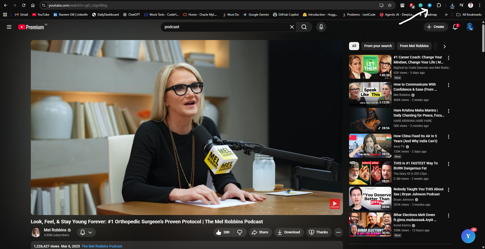
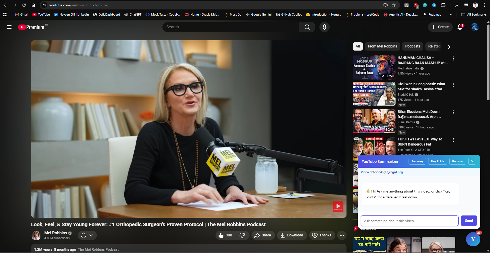
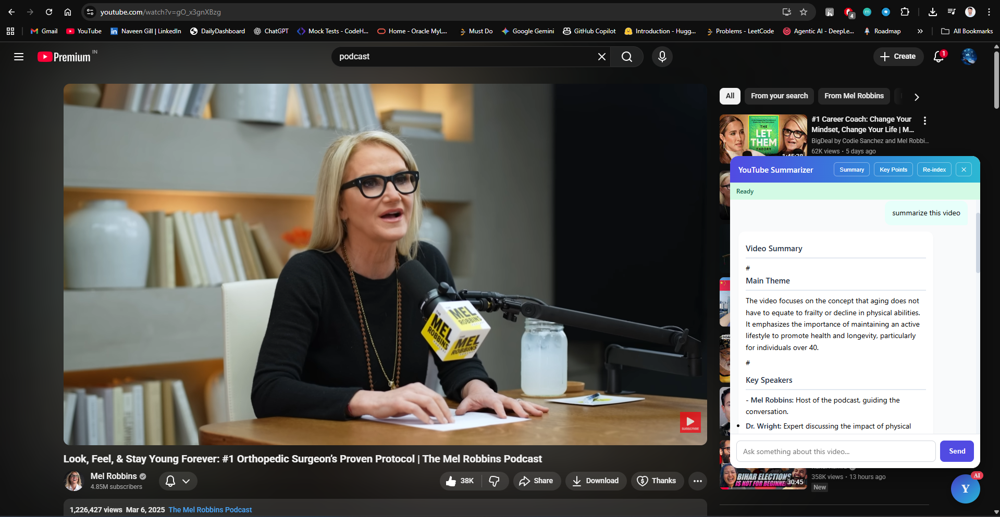
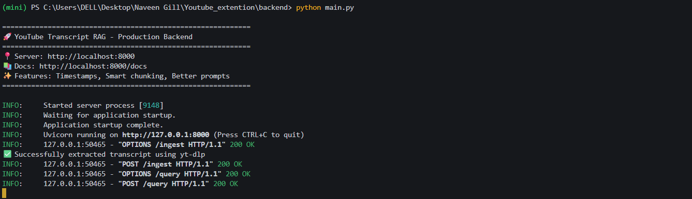
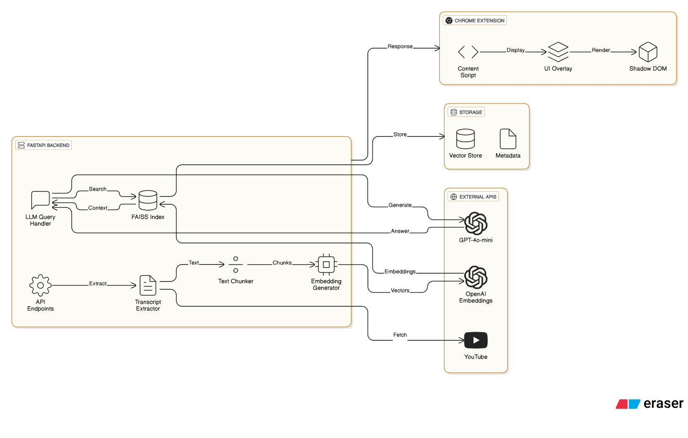

# 🎥 YouTube Summarizer — AI-Powered Chrome Extension

### 🧠 Real-time Summaries, Q&A, Key Points & Semantic Search for Any YouTube Video

A powerful Chrome extension that uses **RAG (Retrieval Augmented Generation)** + a **FastAPI backend** to summarize YouTube videos, answer questions, extract key insights, and jump to timestamps — all using AI.

---

# ✨ Features

### 📝 **AI Video Summary**

Get clean, structured summaries of any YouTube video.

### 🔎 **Semantic Q&A**

Ask natural questions like:

> "What is the main message after 10 minutes?"

> "What are the key takeaways?"

### 🧩 **Vector Search (FAISS)**

Every video transcript is converted into embeddings and searched intelligently.

### ⏱️ **Smart Chunking + Timestamps**

Time-based chunking ensures accuracy & lets you jump to exact parts of the video.

### 💬 **Floating Overlay UI**

Beautiful AI chat overlay inside YouTube using **Shadow DOM**.

---

# 🏗️ Architecture

**Chrome Extension → FastAPI Backend → OpenAI API → FAISS Vector DB**

Full architecture diagram & explanation:
📄 **ARCHITECTURE.md**

---

## 📸 Screenshots

### 🔹 Extension Icon in Chrome


### 🔹 Detected video ID


### 🔹 Asking Question


### 🔹 Backend Running


### 🔹 System Architecture Diagram



---

# 🚀 Technology Stack

### **Frontend (Chrome Extension)**

* Vanilla JavaScript
* Manifest V3
* Shadow DOM Rendering
* Popup UI + Overlay UI

### **Backend (FastAPI)**

* FastAPI
* Python 3.10
* yt-dlp (transcript extraction)
* OpenAI API (GPT-4o-mini + text-embedding-3-small)
* FAISS (vector search)

---

# 📦 Installation Guide

## 🔧 Backend Setup

### **1. Clone Repository**

```bash
git clone https://github.com/NaveenGill124/youtube-summarizer.git
cd youtube-summarizer
```

### **2. Create Virtual Environment**

```bash
python -m venv mini
mini\Scripts\activate        # Windows
# or
source mini/bin/activate     # Mac/Linux
```

### **3. Install Dependencies**

```bash
cd backend
pip install -r requirements.txt
```

### **4. Add OpenAI Key**

Create a `.env` file:

```bash
OPENAI_API_KEY=your_key_here
```

### **5. Run Backend**

```bash
python main.py
```

Backend runs at:

```
http://localhost:8000
```

---

# 🔌 Chrome Extension Setup

1. Open Chrome → go to:

```
chrome://extensions/
```

2. Enable **Developer Mode**
3. Click **Load Unpacked**
4. Select the `youtube-summarizer` folder
5. Open any YouTube video → floating **Y** button will appear

---

# 🎯 Usage

### ✔ **Get Summary**

Click **Summary** to generate a full overview.

### ✔ **Ask Questions**

Ask anything about the video:

```
"What did the speaker say about discipline?"
"Explain the part after 5 minutes."
```

### ✔ **Re-Index**

Rebuild vector store for a fresh transcript.

---

# 📊 Backend API Endpoints

| Method | Endpoint             | Description                               |
| ------ | -------------------- | ----------------------------------------- |
| POST   | `/ingest`            | Stores transcript + FAISS index for video |
| POST   | `/query`             | Answers question using RAG                |
| GET    | `/stats/{video_id}`  | Returns vector store stats                |
| DELETE | `/delete/{video_id}` | Removes stored vector index               |

---

# 🧠 RAG Pipeline (Behind the Scenes)

1. **Extract transcript** (API → HTML → yt-dlp fallback)
2. **Chunk text** (time-based + overlapping)
3. **Generate embeddings** (OpenAI)
4. **Store FAISS index**
5. **Query vectors** (semantic similarity)
6. **Send context to GPT-4o-mini**
7. **Generate final answer**
8. **Display inside overlay**

---

# ⚠ Limitations

* Requires videos with English transcripts
* Some university networks block YouTube transcript API
* First-time indexing may take 3–5 seconds
* OpenAI usage costs apply

---

# 🤝 Contributing

PRs are welcome!
You can help with:

* UI improvements
* Enhancing accuracy
* Adding new features (keyword extraction, notes, bookmarks)

---

# 📜 License

MIT License — free to use, improve, and share.

---

# 💙 Author

Made with ❤️ by **Naveen Gill**
If you like this project, please ⭐ the repository!

